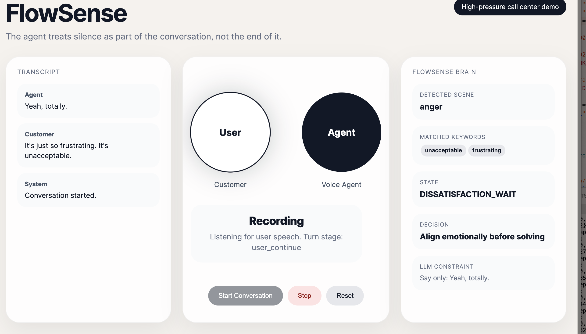

# FlowSense

YouTube Live demo link: (https://youtu.be/rzuFPd_I9Nc), also flowsense.mov in the repository.



Real-time flow-aware conversational AI system.

FlowSense explores how silence, hesitation, interruption, and conversational timing shape human–AI interaction.

Instead of treating pauses as empty space, the system models interaction flow in real time:

* hesitation
* thinking pauses
* backchanneling
* interruption
* overlap
* turn-taking dynamics

## Features

* Real-time speech interaction
* Streaming ASR + TTS
* Barge-in interruption handling
* Timing-aware interaction logic
* Adaptive conversational pacing

## Architecture

```text
User Speech
    ↓
Streaming ASR
    ↓
Interaction Engine
    ↓
LLM Response Strategy
    ↓
Streaming TTS
```

## Stack

* Python
* Flask
* WebSockets
* Gradium ASR
* MiniMax LLM/TTS
* HTML/CSS/JavaScript

## Run

```bash
git clone https://github.com/Yajinou/flowsense.git
cd flowsense
pip install -r requirements.txt
```

Create a `.env` file:

```env
GRADIUM_API_KEY=your_key
MINIMAX_API_KEY=your_key
```

Run:

```bash
python backend/app.py
```

## Structure

```text
FlowSense/
├── backend/
├── frontend/
├── generated_audio/
├── requirements.txt
└── README.md
```

## Vision

Human conversation is not only about what is said.
It is also about:

* when we speak
* when we wait
* when we hesitate
* when we interrupt
* when we stay silent

FlowSense explores conversational timing as an interaction signal.

## License

MIT License

